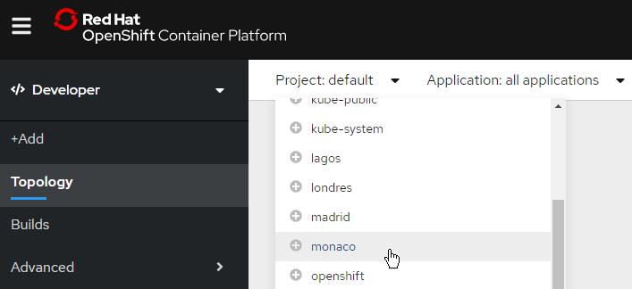

# Задание  агента UNDERCOVER

## (НЕ ИСПОЛЬЗОВАТЬ - СОВЕРШЕННО СЕКРЕТНО)

Это **приложение NodeJS** поможет новому агенту Undercover познакомиться с нашими системами.

Вам будет предоставлена вся необходимая информация, чтобы подключиться к секретной системе UnderCover Network System.

Разверните это приложение в RedHat Openshift cluster, работающем в IBM Cloud и откройте приложение в браузере.

### Тебе потребуется:

- Браузер
- Доступ к RedHat OpenShift Cluster в облаке IBM
- Эта ссылка на GitHub

## ПОДГОТОВКА К ЗАДАНИЮ

- Подключиться к IBM Cloud с собственным логином. Если Вы еще не зарегистрированы в IBM Cloud, то пройдите несложный процесс регистрации: https://cloud.ibm.com/registration. Обратите внимание, что могут возникнуть сложности с использованием публичных российских адресов типа mail.ru, inbox.ru. Как вариант, рекомендуем использовать электронную почту gmail.com. Такой логин точно сработает.
- Отправьте email, используемый для IBM Cloud, для регистрации в игре - через форму https://workshop-resources.eu-de.mybluemix.net/?wi=ocsgame
- Дождитесь приглашения в игру на ваш почтовый адрес, и подтвердите его, нажав ссылку в письме.
- Вы готовы к выполнению задания!

## СЕКРЕТНОЕ ЗАДАНИЕ

- Из секретных источников стало известно, что хакер "Alexander Gavrin" открыл свой аккаунт для всех желающих узнать важный пароль:
	- Зайди в IBM Cloud https://cloud.ibm.com
	- Ты сможешь найти его аккаунт "под" своим именем (нажми на свое имя в консоли и ты увидишь аккаунт **2098226** или [просто нажми здесь](https://cloud.ibm.com/?bss_account=f665a69257a9fbe8b8bf0f77bc69d0d5))
	- Если видишь кластер OpenShift, открой его (или нажми [тут](https://cloud.ibm.com/kubernetes/clusters/c5r6s3uf0h8t6o18c520/overview?region=eu-de&resourceGroup=344f0e06a38c42a4990e2daf9fa41df5&bss_account=f665a69257a9fbe8b8bf0f77bc69d0d5))

- #### Открой консоль Openshift

  - Тебе нужно отключить  **блокировщики всплывающих окон**, так как откроется новая закладка в браузере
	- Первый раз кластер будет открываться долго - возможно, тебе понадобится закрыть окно, и открыть его заново ("Openshift web console")

- Переключись в роль "Developer", **<u>ВЫБЕРИ СВОЙ ПРОЕКТ</u>** (который пришел вам по почте - непример, team1) - не используй "default"**

  

- Создай свое приложение NodeJS **FROM GIT** используя ссылку на этот репозиторий

  - Скопируй и вставь в соответствующее поле URL этого репозитория (https://github.com/ibmworkshops/ocs-forum-2021/)

  - Проверь, что builder image выбран правильно - **NodeJS**

  - **<u>Измени</u>** имя приложения - оно должно быть уникально

      

  - Нажми **Create** 

    - Несколько минут - и твое приложение будет развернуто
		- Посмотри в логи - там видно что происходит

#### Как только приложение развернуто (зеленая галочка, синий кружок), нажми на Open URL

#### Сгенерируй код, который тебе будет необходим для получения приза

**<u>ВЫ ВЫПОЛНИЛИ ЗАДАНИЕ!!!</u>**

