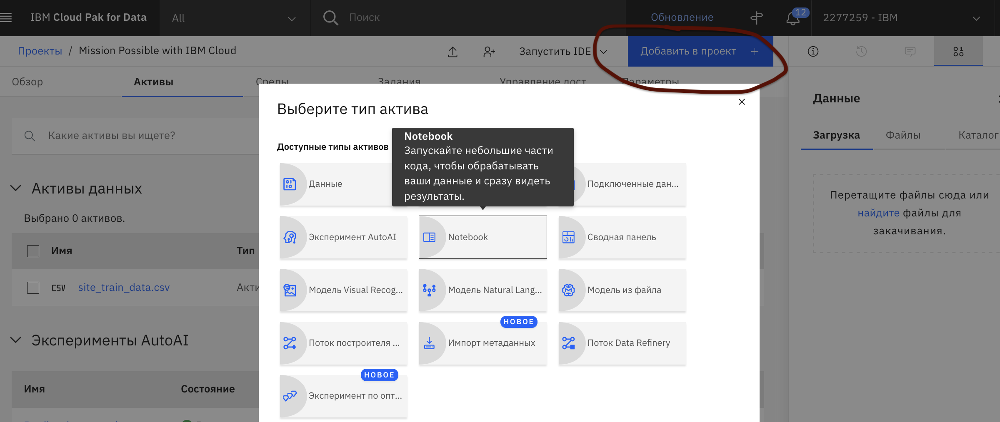

# Задание 3: Секретный код Антон Павловича
Несчастные злоумышленники!
Хакеры добавили ***три однотипных*** кодовых слова в первую главу рассказа А.П. Чехова.
Чтобы их найти, вашему эксперту в области данных и интеллектуального анализа текста потребуется выполнить обработку и кластеризацию текста.
К счастью, можно использовать приведенный ниже код Python, взятый из секретной библиотеки UNDERCOVER.

Python-ноутбук: [Ноутбук](data/Secret_code.ipynb)


## Предварительные условия (пререквизиты)
Для работы с Watson Studio Вы должны:
1. Подключиться к IBM Cloud с собственным логином. Если Вы еще не зарегистрированы в IBM Cloud, то пройдите несложный процесс регистрации: https://cloud.ibm.com/registration. Обратите внимание на то, что могут возникнуть сложности с использованием публичных российских адресов типа @mail.ru, @inbox.ru. Как вариант, рекомендуем использовать электронную почту @gmail.com. Такой логин точно сработает.

2. Создать экземпляр службы Watson Studio. Для этого откройте список ресурсов https://cloud.ibm.com/resources. Если Watson Studio отсутствует в Вашем списке "Services and software", то создайте новую службу через кнопку "Create resource". При этом можно воспользоваться поиском службы и выбрать бесплатный тарифный план "Lite".


## Работа в проекте Watson Studio

### Шаг 1: Создать проект в Watson Studio
1.1. Откройте Watson Studio. Это можно сделать из общего списка сервисов (https://cloud.ibm.com/resources) или через специализированную ссылку: https://dataplatform.cloud.ibm.com/

1.2. Создайте аналитический проект в Watson Studio.
Это можно сделать из основной страницы посредством нажатия кнопки "Создать проект". Или же использовать эту же кнопку из общего списка проектов ("Просмотреть все проекты"). Если у вас еще нет службы хранения, на экране создания проекта вы сможете ее создать и назначить для хранения данных в вашем проекте.
   

Нам достаточно создание "пустого" проекта.


### Шаг 2: Создать новый Notebook
2.1. После создания проекта необходимо создать новый Notebook через кнопку **Добавить в проект**.


2.2. После этого выбрать **из URL**, ввести имя ноутбука, и подставить ссылку ```https://github.com/ibmworkshops/ocs-forum-2021/blob/main/challenges/data/Secret_code.ipynb``` в поле **URL Notebook**. Используйте среду выполнения по умолчанию - **Default Python 3.8 XS (2 vCPU 8 GB RAM)**


2.3. После инициализации ноутбук будет доступен для редактирования и запуска. Запустите ноутбук на выполнение и следуйте инструкциям.


#### Шаг 3:  Сообщи организаторам эти три слова и получи приз
**<u>ВЫ ВЫПОЛНИЛИ ЗАДАНИЕ!!!</u>**


