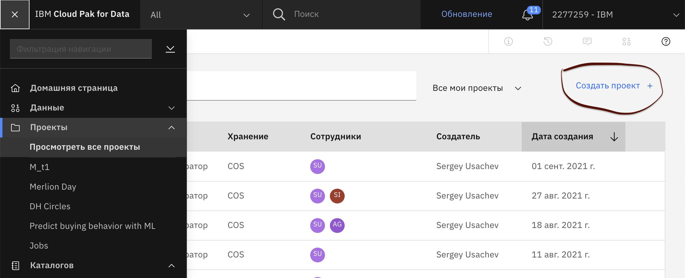
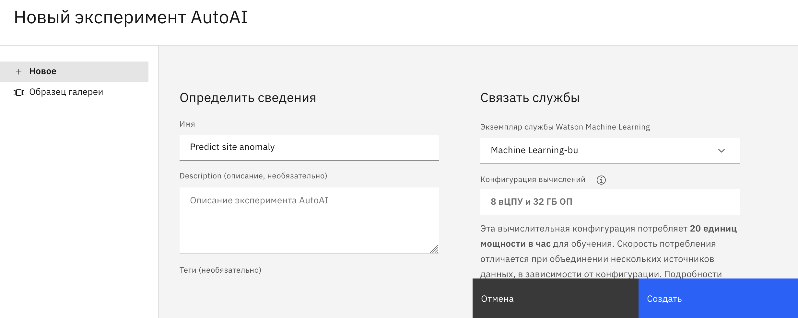
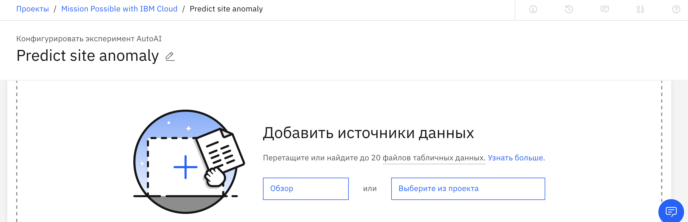
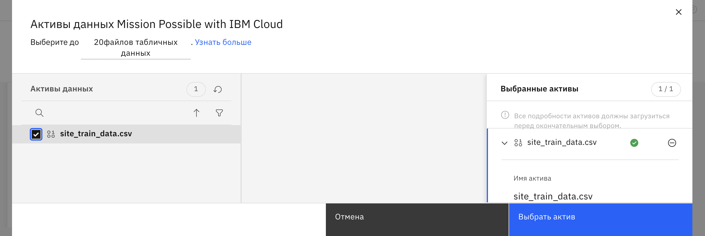

В данном разделе описывается полный процесс от создания проекта, подключения данных и построения прогнозной модели до её публикации, использования для скоринга и последующего просмотра результатов прогнозирования.

## Предварительные условия (пререквизиты)
Вся работа предполагается в решении Watson Studio, которое бесплатно доступно в IBM Cloud. Поэтому перед тем, как начать моделировать, Вы должны:

1. Подключиться к IBM Cloud с собственным логином. Если Вы еще не зарегистрированы в IBM Cloud, то пройдите несложный процесс регистрации: https://cloud.ibm.com/registration. Обратите внимание, что могут возникнуть сложности с использованием публичных российских адресов типа mail.ru, inbox.ru. Как вариант, рекомендуем использовать электронную почту gmail.com. Такой логин точно сработает.

2. Создать экземпляр службы Watson Studio. Для этого откройте список ресурсов https://cloud.ibm.com/resources. Если Watson Studio отсутствует в Вашем списке "Services and software", то создайте новую службу через кнопку "Create resource". При этом можно воспользоваться поиском службы и выбрать бесплатный тарифный план "Lite".

3. Создать экземпляр службы Watson Machine Learning. Действия аналогичны предыдущему пункту с созданием службы Watson Studio.

## Обзор действий

Выполните следующие действия в Watson Studio:

1. Создать проект в Watson Studio;
2. Загрузить данные с обучающей выборкой;
3. Построить и обучить модель;
4. Опубликовать обученную модель;
5. Протестировать опубликованную модель.

### Шаг 1: Создать проект в Watson Studio
1.1. Откройте Watson Studio. Это можно сделать из общего списка сервисов (https://cloud.ibm.com/resources) или через специализированную ссылку: https://dataplatform.cloud.ibm.com/

1.2. Создайте аналитический проект в Watson Studio.
Это можно сделать из основной страницы посредством нажатия кнопки "Создать проект". Или же использовать эту же кнопку из общего списка проектов ("Просмотреть все проекты").
   

Нам достаточно создание "пустого" проекта.

### Шаг 2: Загрузить данные с обучающей выборкой
2.1. Сохраните на локальный диск файл с обучающей выборкой: https://github.com/ibmworkshops/ocs-forum-2021/blob/main/challenges/data/Train_data.csv

2.2. В созданном проекте Watson Studio для загрузки данных можно воспользоваться кнопкой "Add to project" ("Добавить в проект"), выбрать тип "Данные" и указать сохраненный файл.

2.3. Найдите загруженную таблицу с данными в списке активов проекта ("assets"). При желании Вы можете просмотреть содержимое таблицы и сделать её профилирование (закладка Профиль / Создать профиль).

### Шаг 3: Построить и обучить модель
* 3.1 Укажите основные сведения о модели
На странице Assets ("Активы") вашего проекта в Watson Studio нажмите "Add to project" ("Добавить в проект") и выберите "AutoAI Experiment".

На открывшейся странице заполните основные поля:
   - Укажите имя и необязательное описание для вашей новой модели.

   - Убедитесь, что экземпляр службы IBM Watson Machine Learning связан с вашим проектом. Если этого нет, то воспользуйтесь режимом "Свяжите экземпляр службы машинного обучения", выберите из списка службу  Watson Machine Learning и свяжите с ней проект.

   - Нажмите "Создать".

* 3.2 Добавить источники данных. Рекомендуем использовать уже загруженные данные в составе проекта (режим "Выберите из проекта"). Если данные ранее не были загружены, то можно воспользоваться кнопкой "Обзор" и выбрать новый файл (csv).

* 3.3 Укажите прогнозируемый столбец
Ответьте на вопрос "Что вы хотите предсказать?". В нашем случае нужно выбрать столбец «CLASS».

* 3.4 Запустите обучение модели
Нажмите Запустить эксперимент (Run experiment).

Список алгоритмов или оценок, доступных для каждого метода машинного обучения в AutoAI, см.:
[Детали внедрения AutoAI](https://dataplatform.cloud.ibm.com/docs/content/wsj/analyze-data/autoai-details.html?audience=wdp)

По мере обучения модели вы увидите инфографику, показывающую процесс построения конвейера (пайплайна).

* 3.4 Выбор конвейера
После завершения создания конвейера вы можете просмотреть и сравнить полученные модели в таблице (leaderboard).

Выберите «Сохранить модель» ("Save model") в меню действий для модели с рангом 1. При этом модель будет сохранена как актив в вашем проекте.

### Шаг 4: Опубликовать обученную модель
Прежде чем вы сможете использовать свою обученную модель для прогнозирования новых данных, вы должны опубликовать модель в пространстве внедрения (deployments space).
Откройте страницу Assets для проекта и откройте вашу модель. На странице сведений о модели:

   - Нажимите "Продвинуть в пространство внедрения"
   
   - Выберите из списка существующее пространство внедрения (deployments space) или создайте новое.
   - Нажмите кнопку "Продвинуть"
   

Откройте пространство внедрения (Deployments space):

   - Из общего меню выберите "Показать все пространства"

   - Выберите ваше пространство внедрения
   
   - Выберите вкладку Активы и найдите Вашу модель
   
   - Нажмите кнопку "Создать внедрение" (если служба "machine learning" не привязана, то нужно сделать привязку)
   - Выберите тип внедрения "Онлайновое", укажите имя и нажмите "Создать"
   
   - Найдите внедренную модель на закладке "Внедрения" и откройте её.
   

### Шаг 5: Протестировать опубликованную модель
Вы можете протестировать развернутую модель на странице сведений о развертывании ** тремя ** способами:

### a) Тестирование с формой
На вкладке «Тест» (Test tab) страницы сведений о развертывании щелкните значок «Предоставить входные данные с помощью формы» (Provide input data using form), введите данные теста и нажмите «Прогнозировать» (Predict), чтобы увидеть результат.

### b) Тестирование с JSON
На вкладке «Тест» (Test tab) страницы сведений о развертывании щелкните значок «Предоставить входные данные в формате JSON» (Provide input data as JSON ) и введите следующие данные с нашими четырьмя сайтами:

``{"input_data":[{"fields": ["duration", "protocol_type", "service", "flag", "src_bytes", "dst_bytes", "land", "wrong_fragment", "urgent", "hot", "num_failed_logins", "logged_in", "num_compromised", "root_shell", "su_attempted", "num_root", "num_file_creations", "num_shells", "num_access_files", "num_outbound_cmds", "is_host_login", "is_guest_login", "count", "srv_count", "serror_rate", "srv_serror_rate", "rerror_rate", "srv_rerror_rate", "same_srv_rate", "diff_srv_rate", "srv_diff_host_rate", "dst_host_count", "dst_host_srv_count", "dst_host_same_srv_rate", "dst_host_diff_srv_rate", "dst_host_same_src_port_rate", "dst_host_srv_diff_host_rate", "dst_host_serror_rate", "dst_host_srv_serror_rate", "dst_host_rerror_rate", "dst_host_srv_rerror_rate"], "values":[ [0,"tcp","http","SF",233,2239,0,0,0,0,0,1,0,0,0,0,0,0,0,0,0,0,3,3,0,0,0,0,1,0,0,255,197,0.77,0.02,0,0,0,0,0,0], [31,"tcp","telnet","SF",197,1608,0,0,0,1,0,1,1,0,0,1,2,1,0,0,0,0,1,1,0,0,0,0,1,0,0,248,32,0.13,0.03,0,0,0,0,0,0], [0,"tcp","systat","S0",0,0,0,0,0,0,0,0,0,0,0,0,0,0,0,0,0,0,239,20,1,1,0,0,0.08,0.07,0,255,20,0.08,0.08,0,0,1,1,0,0], [0,"tcp","http","SF",277,4968,0,0,0,0,0,1,0,0,0,0,0,0,0,0,0,0,13,13,0,0,0,0,1,0,0,13,255,1,0,0.08,0.01,0,0,0,0] ]}]}``

### c) Тестирование с Jupyter Notebook (опционально)

Также вы можете вызвать модель через Jupyter Notebook.

